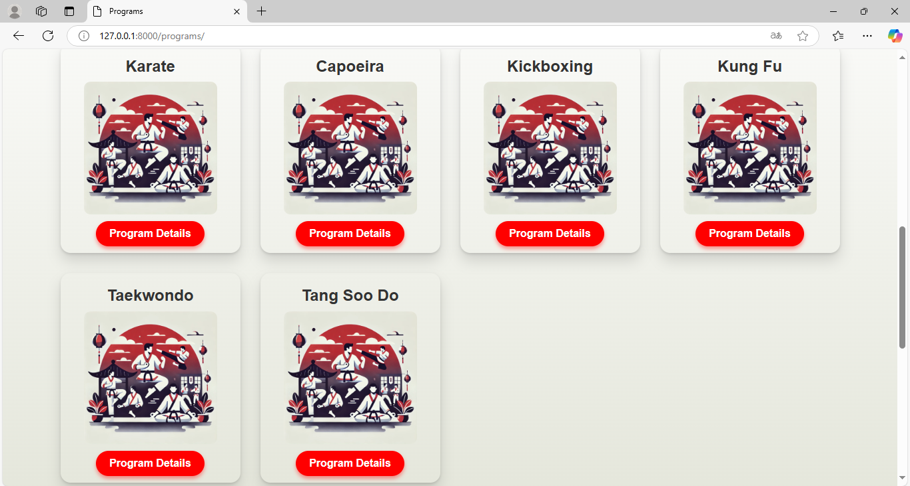

# Karate_Instructor
🥋 Karate Instructor is an innovative app that helps users improve their martial arts skills. 🌟 Users can select their preferred martial art 🥷 and choose specific movements they want to practice. 💪 The app provides real-time feedback and correction 🎯 by analyzing the user's movements using advanced motion-capture technology. 📹🤖 Here is the website:
------------------------------------------------------------------------------------------------------------------------------------------------

------------------------------------------------------------------------------------------------------------------------------------------------

